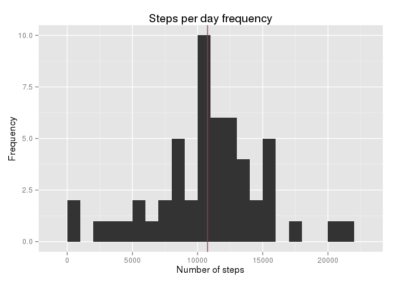
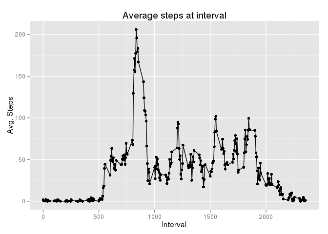
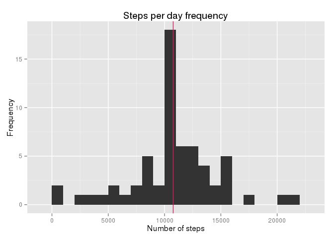
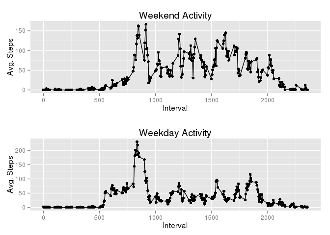

# Reproducible Research: Peer Assessment 1

## Import all libraries to be used

```r
require(ggplot2)
```

```
## Loading required package: ggplot2
```

```r
require(lubridate)
```

```
## Loading required package: lubridate
```

```r
require(gridExtra)
```

```
## Loading required package: gridExtra
```

## Loading and preprocessing the data

To load the data we just need to extract it from the zip file:

```r
unzip("activity.zip")
```

Then load the csv as follows:

```r
df <- read.csv("activity.csv")
```

Then, we can take an initial look at the data:

```r
head(df, 10)
```

```
##    steps       date interval
## 1     NA 2012-10-01        0
## 2     NA 2012-10-01        5
## 3     NA 2012-10-01       10
## 4     NA 2012-10-01       15
## 5     NA 2012-10-01       20
## 6     NA 2012-10-01       25
## 7     NA 2012-10-01       30
## 8     NA 2012-10-01       35
## 9     NA 2012-10-01       40
## 10    NA 2012-10-01       45
```

```r
summary(df)
```

```
##      steps                date          interval     
##  Min.   :  0.00   2012-10-01:  288   Min.   :   0.0  
##  1st Qu.:  0.00   2012-10-02:  288   1st Qu.: 588.8  
##  Median :  0.00   2012-10-03:  288   Median :1177.5  
##  Mean   : 37.38   2012-10-04:  288   Mean   :1177.5  
##  3rd Qu.: 12.00   2012-10-05:  288   3rd Qu.:1766.2  
##  Max.   :806.00   2012-10-06:  288   Max.   :2355.0  
##  NA's   :2304     (Other)   :15840
```


## What is mean total number of steps taken per day?
First, let's extract the daily data into a different data frame:


```r
spd <- data.frame(tapply(df$steps, df$date, FUN = sum))
names(spd) <- c("steps")
head(spd)
```

```
##            steps
## 2012-10-01    NA
## 2012-10-02   126
## 2012-10-03 11352
## 2012-10-04 12116
## 2012-10-05 13294
## 2012-10-06 15420
```

```r
summary(spd)
```

```
##      steps      
##  Min.   :   41  
##  1st Qu.: 8841  
##  Median :10765  
##  Mean   :10766  
##  3rd Qu.:13294  
##  Max.   :21194  
##  NA's   :8
```

Now let's print a histogram of the number of steps per day:

```r
ggplot(spd, aes(x=steps)) + geom_histogram(binwidth = 1000) + geom_vline(aes(xintercept=mean(steps, na.rm = TRUE)), color="maroon") + ggtitle("Steps per day frequency") + xlab("Number of steps") + ylab("Frequency")
```

 

As you can see the mean and median are as follows:

```r
with(spd, mean(steps, na.rm = TRUE))
```

```
## [1] 10766.19
```

```r
with(spd, median(steps, na.rm = TRUE))
```

```
## [1] 10765
```

## What is the average daily activity pattern?
Let's again, prepare a data frame to explore the values:


```r
spi <- data.frame(tapply(df$steps, df$interval, FUN = mean, na.rm=TRUE))
names(spi) <- c("avg")
head(spi)
```

```
##          avg
## 0  1.7169811
## 5  0.3396226
## 10 0.1320755
## 15 0.1509434
## 20 0.0754717
## 25 2.0943396
```

```r
tail(spi)
```

```
##            avg
## 2330 2.6037736
## 2335 4.6981132
## 2340 3.3018868
## 2345 0.6415094
## 2350 0.2264151
## 2355 1.0754717
```

```r
summary(spi)
```

```
##       avg         
##  Min.   :  0.000  
##  1st Qu.:  2.486  
##  Median : 34.113  
##  Mean   : 37.383  
##  3rd Qu.: 52.835  
##  Max.   :206.170
```

Now, let's plot the average steps taken each interval accross the dates:

```r
ggplot(spi, aes(as.numeric(row.names(spi)), avg)) + geom_point() + geom_line() + ggtitle("Average steps at interval") + xlab("Interval") + ylab("Avg. Steps")
```

 

We can see that the 5 minute interval in which this subject has the maximum number of steps is:

```r
spi[spi$avg == max(spi$avg),]
```

```
##      835 
## 206.1698
```

## Imputing missing values
However, the original dataset had lots of NA's that might be changing the result of the analysis. Let's investigate and fix this issue:

```r
length(df$steps)
```

```
## [1] 17568
```

```r
sum(is.na(df))
```

```
## [1] 2304
```

```r
sum(is.na(df))/length(df$steps)*100
```

```
## [1] 13.11475
```

About 13% of the values are missing. Let's replace them by the interval's average:

```r
df$steps2 <- df$steps
df[is.na(df$steps), "steps"] <- spi[,"avg"]
```

Let's create a new dataset with the cleaned values and return the original to the initial state:

```r
df2 <- df
df$steps <- df$steps2
df$steps2 <- NULL
df2$steps2 <- NULL
head(df)
```

```
##   steps       date interval
## 1    NA 2012-10-01        0
## 2    NA 2012-10-01        5
## 3    NA 2012-10-01       10
## 4    NA 2012-10-01       15
## 5    NA 2012-10-01       20
## 6    NA 2012-10-01       25
```

```r
head(df2)
```

```
##       steps       date interval
## 1 1.7169811 2012-10-01        0
## 2 0.3396226 2012-10-01        5
## 3 0.1320755 2012-10-01       10
## 4 0.1509434 2012-10-01       15
## 5 0.0754717 2012-10-01       20
## 6 2.0943396 2012-10-01       25
```

```r
summary(df)
```

```
##      steps                date          interval     
##  Min.   :  0.00   2012-10-01:  288   Min.   :   0.0  
##  1st Qu.:  0.00   2012-10-02:  288   1st Qu.: 588.8  
##  Median :  0.00   2012-10-03:  288   Median :1177.5  
##  Mean   : 37.38   2012-10-04:  288   Mean   :1177.5  
##  3rd Qu.: 12.00   2012-10-05:  288   3rd Qu.:1766.2  
##  Max.   :806.00   2012-10-06:  288   Max.   :2355.0  
##  NA's   :2304     (Other)   :15840
```

```r
summary(df2)
```

```
##      steps                date          interval     
##  Min.   :  0.00   2012-10-01:  288   Min.   :   0.0  
##  1st Qu.:  0.00   2012-10-02:  288   1st Qu.: 588.8  
##  Median :  0.00   2012-10-03:  288   Median :1177.5  
##  Mean   : 37.38   2012-10-04:  288   Mean   :1177.5  
##  3rd Qu.: 27.00   2012-10-05:  288   3rd Qu.:1766.2  
##  Max.   :806.00   2012-10-06:  288   Max.   :2355.0  
##                   (Other)   :15840
```

```r
any(is.na(df$steps))
```

```
## [1] TRUE
```

```r
any(is.na(df2$steps))
```

```
## [1] FALSE
```


Now that we took care of missing values, let's calculate the mean and median once again and see the effect of our changes:

```r
spd2 <- data.frame(tapply(df2$steps, df2$date, FUN = sum))
names(spd2) <- c("steps")
head(spd2)
```

```
##               steps
## 2012-10-01 10766.19
## 2012-10-02   126.00
## 2012-10-03 11352.00
## 2012-10-04 12116.00
## 2012-10-05 13294.00
## 2012-10-06 15420.00
```

```r
summary(spd2)
```

```
##      steps      
##  Min.   :   41  
##  1st Qu.: 9819  
##  Median :10766  
##  Mean   :10766  
##  3rd Qu.:12811  
##  Max.   :21194
```

Now let's print a histogram of the number of steps per day:

```r
ggplot(spd2, aes(x=steps)) + geom_histogram(binwidth = 1000) + geom_vline(aes(xintercept=mean(steps, na.rm = TRUE)), color="maroon") + ggtitle("Steps per day frequency") + xlab("Number of steps") + ylab("Frequency")
```

 

As you can see the mean and median are as follows:

```r
with(spd2, mean(steps, na.rm = TRUE))
```

```
## [1] 10766.19
```

```r
with(spd2, median(steps, na.rm = TRUE))
```

```
## [1] 10766.19
```

Surprisingly, the median and mean now are equal. This is the effect of changing the NA's values.

## Are there differences in activity patterns between weekdays and weekends?
First, let's add a factor variable representing the weekend and weekdays days:

```r
df2$weekday <- as.factor(ifelse(wday(as.Date(df2$date)) == 1 | wday(as.Date(df2$date)) == 7, "weekend", "weekday"))
summary(df2)
```

```
##      steps                date          interval         weekday     
##  Min.   :  0.00   2012-10-01:  288   Min.   :   0.0   weekday:12960  
##  1st Qu.:  0.00   2012-10-02:  288   1st Qu.: 588.8   weekend: 4608  
##  Median :  0.00   2012-10-03:  288   Median :1177.5                  
##  Mean   : 37.38   2012-10-04:  288   Mean   :1177.5                  
##  3rd Qu.: 27.00   2012-10-05:  288   3rd Qu.:1766.2                  
##  Max.   :806.00   2012-10-06:  288   Max.   :2355.0                  
##                   (Other)   :15840
```

Let's extract the values per weekday:

```r
wdd <- subset(df2, df2$weekday == "weekend")
wyd <- subset(df2, df2$weekday == "weekday")
wdspi <- data.frame(tapply(wdd$steps, wdd$interval, FUN = mean, na.rm=TRUE))
wyspi <- data.frame(tapply(wyd$steps, wyd$interval, FUN = mean, na.rm=TRUE))
names(wdspi) <- c("avg")
names(wyspi) <- c("avg")
head(wdspi)
```

```
##            avg
## 0  0.214622642
## 5  0.042452830
## 10 0.016509434
## 15 0.018867925
## 20 0.009433962
## 25 3.511792453
```

```r
head(wyspi)
```

```
##           avg
## 0  2.25115304
## 5  0.44528302
## 10 0.17316562
## 15 0.19790356
## 20 0.09895178
## 25 1.59035639
```

```r
tail(wdspi)
```

```
##              avg
## 2330  1.38797170
## 2335 11.58726415
## 2340  6.28773585
## 2345  1.70518868
## 2350  0.02830189
## 2355  0.13443396
```

```r
tail(wyspi)
```

```
##            avg
## 2330 3.0360587
## 2335 2.2486373
## 2340 2.2402516
## 2345 0.2633124
## 2350 0.2968553
## 2355 1.4100629
```

```r
summary(wdspi)
```

```
##       avg         
##  Min.   :  0.000  
##  1st Qu.:  1.241  
##  Median : 32.340  
##  Mean   : 42.366  
##  3rd Qu.: 74.654  
##  Max.   :166.639
```

```r
summary(wyspi)
```

```
##       avg         
##  Min.   :  0.000  
##  1st Qu.:  2.247  
##  Median : 25.803  
##  Mean   : 35.611  
##  3rd Qu.: 50.854  
##  Max.   :230.378
```

Now, let's compare the interval activity per weekday:

```r
wdplot <- ggplot(wdspi, aes(as.numeric(row.names(wdspi)), avg)) + geom_point() + geom_line() + ggtitle("Weekend Activity") + xlab("Interval") + ylab("Avg. Steps") 
wyplot <- ggplot(wyspi, aes(as.numeric(row.names(wyspi)), avg)) + geom_point() + geom_line() + ggtitle("Weekday Activity") + xlab("Interval") + ylab("Avg. Steps")
grid.arrange(wdplot, wyplot, nrow=2)
```

 

Interestingly, the average number of steps in weekdays is greater than in weekends, however, the weekend max is greater than the weekday max.
 
 
 
